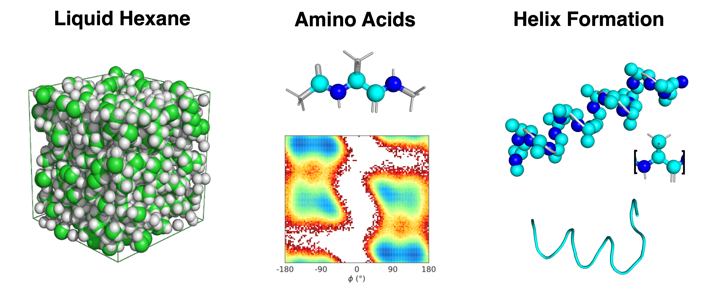

> **_NOTE:_** Initial code release. More extensive documentation will be added soon.

# CG Mapping Benchmark 
Testing different coarse-graining (CG) mappings with classical and machine learning potentials (MLPs).



## Code Structure

The repository is organized into the following structure:

```
CG-Mapping-Benchmark/
├── cgbench/                    # Main package (installable)
│   ├── core/                   # Core functionality
│   │   ├── mapping.py          # Mapping classes (Hexane_Map, Ala2_Map, etc.)
│   │   ├── dataset.py          # Dataset classes (BaseDataset, Hexane_Dataset, etc.)
│   │   └── config.py           # Configuration (Dataset_paths, default configs)
│   └── utils/                  # Utility functions
│       ├── helpers.py          # General helper functions (plotting, calculations)
│       ├── analysis.py         # Structural analysis utilities
│       └── visualization.py    # Trajectory visualization functions
│
├── scripts/                    # Executable scripts
│   ├── training/               # Training scripts
│   │   ├── run_mace_training.py
│   │   └── run_nequip_training.py
│   ├── simulation/            # Simulation scripts
│   │   ├── run_mace_simulation.py
│   │   └── run_nequip_simulation.py
│   └── utils/                 # Utility scripts
│       └── extract_hexane_conf.py
│
├── notebooks/                 # Jupyter notebooks for analysis
│   ├── ala15.ipynb
│   ├── hexane.ipynb
│   ├── amino_acids.ipynb
│   └── chirality_metadynamics.ipynb
│
├── data/                      # Reference data
│   └── reference_simulations/  # Reference simulation data
│       ├── hexane/
│       └── peptides/
│
├── results/                    # Analysis results
│   ├── Ala15/                 # Alanine 15-mer results
│   ├── Amino_acids/           # Amino acid results
│   ├── Hexane/                # Hexane results
│   └── Chirality_inversion/   # Chirality inversion results
│
└── outputs/                    # Training outputs
    ├── MLP_train/             # MLP training results
    ├── MLP_train_nequip/     # NequIP training results
    ├── MLP_train_allegro/     # Allegro training results
    └── MLP_train_dimenet/     # DimeNet training results
```

### Package Usage

The `cgbench` package can be imported and used as follows:

```python
# Import core functionality
from cgbench.core import dataset, mapping, config
from cgbench.core.dataset import Hexane_Dataset, Ala2_Dataset
from cgbench.core.mapping import Hexane_Map, Ala2_Map

# Import utilities
from cgbench.utils import helpers, analysis, visualization
from cgbench.utils.helpers import plot_predictions, plot_convergence
```

### Running Scripts

Scripts are located in the `scripts/` directory and can be run from the repository root:

```bash
# Training
python scripts/training/run_mace_training.py --mol hexane --cgmap two-site --rcut 0.8

# Simulation
python scripts/simulation/run_mace_simulation.py --model path/to/model --mol hexane
```

## Systems

- `results/Hexane/` - Liquid hexane system, adapted from Ruehle et al.[^1]
- `results/Amino_acids/` - Single, capped amino acids
- `results/Ala15/` - Alanine 15-mer

## References
[^1]: Ruhle, Victor, et al. "Versatile object-oriented toolkit for coarse-graining applications." Journal of chemical theory and computation 5.12 (2009): 3211-3223.