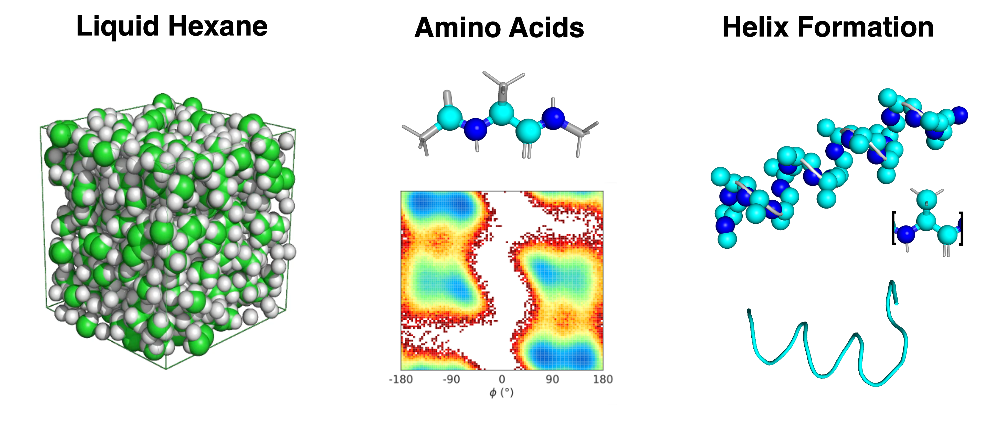

> **_NOTE:_** This codebase is continuously updated. The state for the JCIM publication "Mapping Still Matters: Coarse-Graining with Machine Learning Potentials" can be found in the branch `JCIM-acs.jcim.5c03035` (latest commit `08d2fa0`).

# CG Mapping Benchmark 
Testing different coarse-graining (CG) mappings with classical and machine learning potentials (MLPs).



## Code Structure

The repository is organized into the following structure:

```
CG-Mapping-Benchmark/
├── cgbench/                    # Main package (installable)
│   ├── core/                   # Core functionality
│   │   ├── mapping.py          # CG mapping definitions and mapping helpers
│   │   ├── dataset.py          # Dataset loaders and preprocessing wrappers
│   │   ├── prior.py            # Boltzmann inversion and spline prior models
│   │   └── config.py           # Default model/train/simulation configurations
│   ├── utils/                  # Analysis and geometry utilities
│   │   ├── io.py
│   │   ├── chains.py
│   │   ├── geometry.py
│   │   └── structural.py
│   └── plotting/               # Plotting and visualization utilities
│       ├── style.py
│       ├── distributions.py
│       ├── structural.py
│       ├── timeseries.py
│       ├── training.py
│       ├── priors.py
│       └── molecules.py
│
├── scripts/                    # Executable scripts
│   ├── run_fm_training.py      # Unified FM training (MACE/NequIP/Spline)
│   ├── run_simulation.py       # Unified simulation script
│   └── utils.py                # Shared helpers used by scripts
│
├── notebooks/                 # Jupyter notebooks for analysis
│   ├── ala15.ipynb
│   ├── hexane.ipynb
│   ├── amino_acids.ipynb
│   ├── chirality_metadynamics.ipynb
│   └── test.ipynb
│
├── data/                      # Reference data and metadata
│   ├── preview.png
│   ├── residue_maps.json
│   └── reference_simulations/ # Reference simulation data
│       ├── hexane/
│       └── peptides/
│
├── results/                    # Analysis results
│   ├── Ala15/                 # Alanine 15-mer results
│   ├── Amino_acids/           # Amino acid results
│   ├── Hexane/                # Hexane results
│   └── Chirality_inversion/   # Chirality inversion results
│
├── outputs/                    # Model training and simulation outputs
│   ├── Model=mace/
│   ├── Model=spline/
│   ├── MLP_train/
│   └── prior_test/
├── external/                   # External model backends and layers
│   └── models/
├── checkpoints/                # Saved checkpoint artifacts
└── tests/                      # Test suite
```

### Package Usage

The `cgbench` package can be imported and used as follows:

```python
# Import core functionality
from cgbench.core import dataset, mapping, config, prior
from cgbench.core.dataset import Hexane_Dataset, Capped_Ala2_Dataset
from cgbench.core.mapping import Hexane_Map, CappedPeptideMap

# Import utilities
from cgbench.utils import io, chains, geometry, structural

# Import plotting helpers
from cgbench.plotting import training, structural as structural_plots
```

### Running Scripts

Scripts are located in the `scripts/` directory and can be run from the repository root:

```bash
# Unified force-matching training (MACE example)
# Default model config comes from cgbench.core.config.py, flags overwrite default
python scripts/run_fm_training.py --model mace --mol hexane --cgmap two-site --rcut 0.8

# Unified simulation (model backend is inferred from config.json)
# Default sim config comes from cgbench.core.config.py, flags overwrite default
python scripts/run_simulation.py --model outputs/Model=mace/<run>/best_params.pkl --mol hexane --dt 2 --t-total 100 --n-chains 1
```

## Systems

- `results/Hexane/` - Liquid hexane system, adapted from Ruehle et al.[^1]
- `results/Amino_acids/` - Single, capped amino acids
- `results/Ala15/` - Alanine 15-mer

## References
[^1]: Ruhle, Victor, et al. "Versatile object-oriented toolkit for coarse-graining applications." Journal of chemical theory and computation 5.12 (2009): 3211-3223.